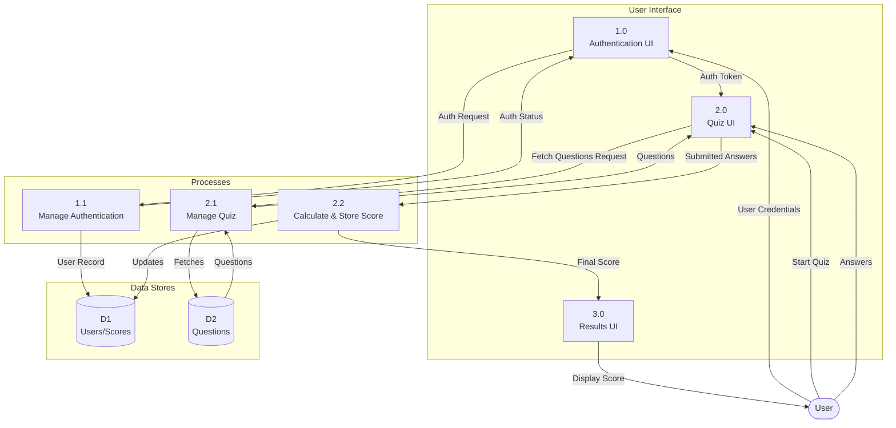
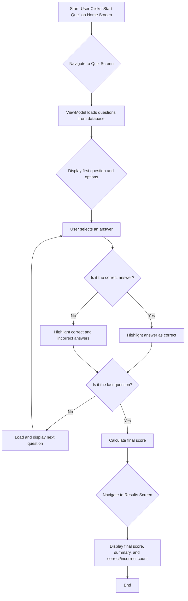
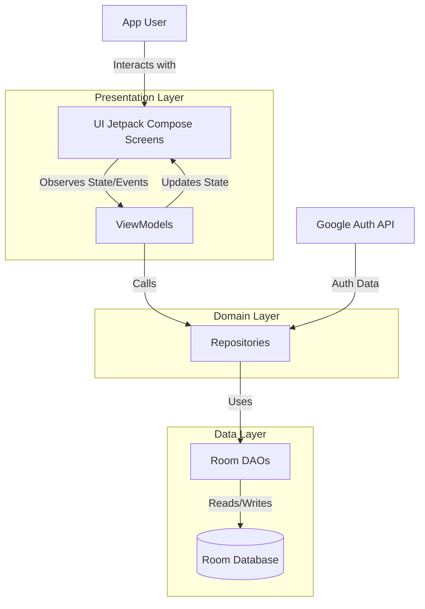

# 📱 SmartQuiz – Android Quiz Application

SmartQuiz is an Android quiz application developed using **Jetpack Compose** and **MVVM architecture**.  
The project is built as a **team-based application (4 members)** with a strong emphasis on **clean code, modular design, and scalability**.

---

## 📌 Project Description

SmartQuiz allows users to:
- Sign in using Google authentication
- View available quizzes
- Attempt quizzes with multiple questions
- Select interests to personalize quiz suggestions
- View quiz attempt history
- View quiz results

The application is designed to support multiple features developed independently and integrated seamlessly.

---

## 🧩 Features

### 🔐 Authentication
- Google Sign-In
- User session handling

### 🏠 Home
- Display active quizzes
- Display suggested quizzes based on interests

### 🧠 Quiz
- Quiz list screen
- Quiz play screen (questions & options)
- Quiz result screen

### 👤 Profile
- View user details
- Select and edit quiz interests

### 📜 History
- View previously attempted quizzes
- Display scores and timestamps

---

## 🛠️ Tech Stack

- **Language:** Kotlin
- **UI:** Jetpack Compose
- **Architecture:** MVVM (Model–View–ViewModel)
- **Navigation:** Navigation Compose
- **Database:** Room (SQLite)
- **Concurrency:** Kotlin Coroutines
- **Build System:** Gradle (Kotlin DSL)

---

## 🏗️ Architecture Overview

The application follows a **feature-based MVVM architecture**:

UI (Compose Screens)  
&nbsp;&nbsp;&nbsp;&nbsp;&nbsp;&nbsp;↓  
&nbsp;ViewModel  
&nbsp;&nbsp;&nbsp;&nbsp;&nbsp;&nbsp;↓  
&nbsp;Repository  
&nbsp;&nbsp;&nbsp;&nbsp;&nbsp;&nbsp;↓  
Room Database (DAO → Entity)

### Architectural Guidelines
- No business logic in UI
- ViewModels manage state and logic
- Repositories abstract data operations
- Database access only via DAO
- Navigation logic separated from UI

---

## 📂 Project Structure

com.example.smartquiz  
│  
├── data  
│ ├── local  
│ │ ├── entity  
│ │ ├── dao  
│ │ └── database  
│ └── repository  
│  
├── navigation  
│ ├── Routes.kt  
│ ├── RootNavGraph.kt  
│ ├── auth  
│ ├── home  
│ ├── quiz  
│ └── profile  
│
├── ui  
│ ├── auth  
│ ├── home  
│ ├── quiz  
│ ├── profile  
│ └── history  
│
├── viewmodel  
├── utils  
├── theme  
├── MainActivity.kt    
└── QuizApplication.kt 

---

## 🧭 Navigation Design

- Centralized navigation contract using `Routes.kt`
- Feature-wise navigation graphs
- Single root NavHost in `MainActivity`
- Screens communicate via callbacks
- Navigation logic is not placed inside ViewModels

---

## Diagrams

### Data Flow Diagram (Level 1)

This DFD illustrates the high-level flow of data between the user, the main processes of the app, and the data stores.

### Flowchart: Taking a Quiz

This flowchart details the step-by-step process a user goes through when taking a quiz.

### System Architecture Diagram

This diagram visualizes the MVVM architecture and data flow described in the repository:

----
